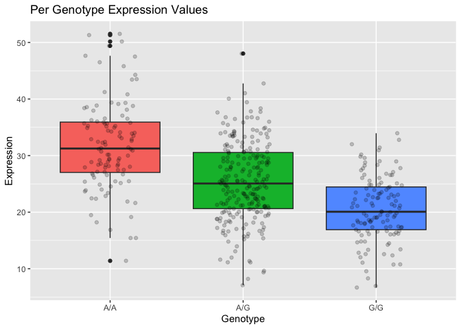

# Lab 12
Na Youn Soo (PID: A17014731)

> Q13. Read this file into R and determine the sample size for each
> genotype and their corresponding median expression levels for each of
> these genotypes.

``` r
file <- read.table("rs8067378_ENSG00000172057.6.txt")
```

``` r
summary(file)
```

        sample              geno                exp        
     Length:462         Length:462         Min.   : 6.675  
     Class :character   Class :character   1st Qu.:20.004  
     Mode  :character   Mode  :character   Median :25.116  
                                           Mean   :25.640  
                                           3rd Qu.:30.779  
                                           Max.   :51.518  

``` r
# Sample size for each genotype
table(file$geno)
```


    A/A A/G G/G 
    108 233 121 

``` r
aa <- subset(file, geno == "A/A")
# Median Expression Levels of genotype A/A samples
median(aa$exp)
```

    [1] 31.24847

``` r
ag <- subset(file, geno == "A/G")
# Median Expression Levels of genotype A/G samples
median(ag$exp)
```

    [1] 25.06486

``` r
gg <- subset(file, geno == "G/G")
# Median Expression Levels of genotype G/G samples
median(gg$exp)
```

    [1] 20.07363

> Q14. Generate a boxplot with a box per genotype, what could you infer
> from the relative expression value between A/A and G/G displayed in
> this plot? Does the SNP effect the expression of ORMDL3?

``` r
library(ggplot2)

ggplot(file, aes(geno, exp, fill = geno)) +
         geom_boxplot() +
  guides(fill="none") +
    geom_jitter(width = 0.2, alpha = 0.2) +
  labs(title="Per Genotype Expression Values", x = "Genotype", y = "Expression")
```



A/A is expressed more than G/G

Given the large difference in expression between the genotypes, I
believe SNP affects the expression of ORMDL3.
