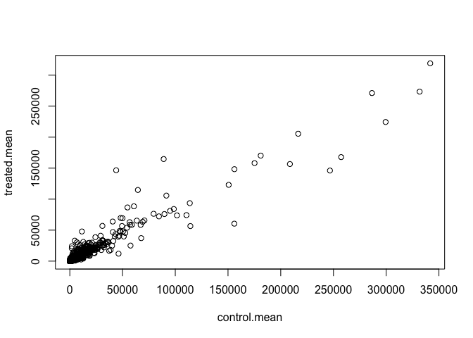
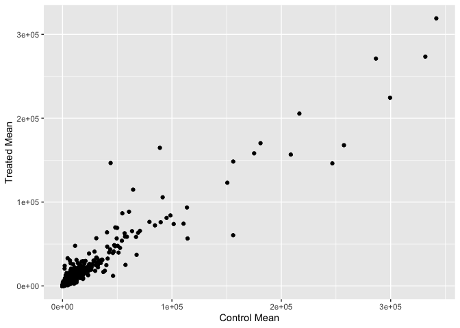
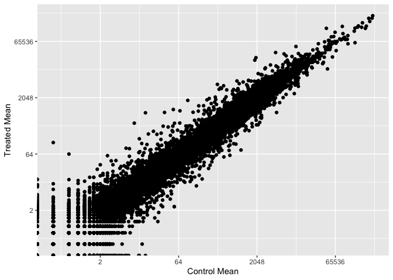
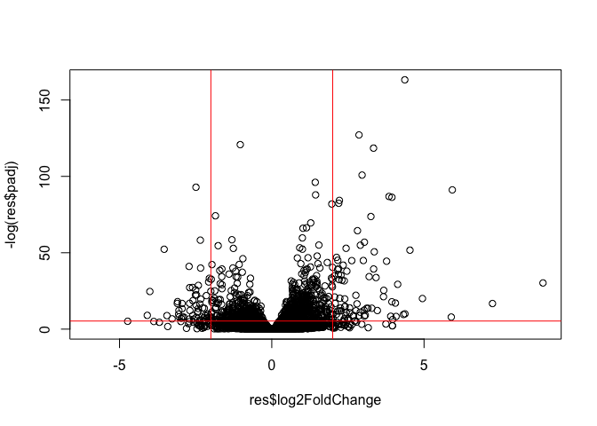
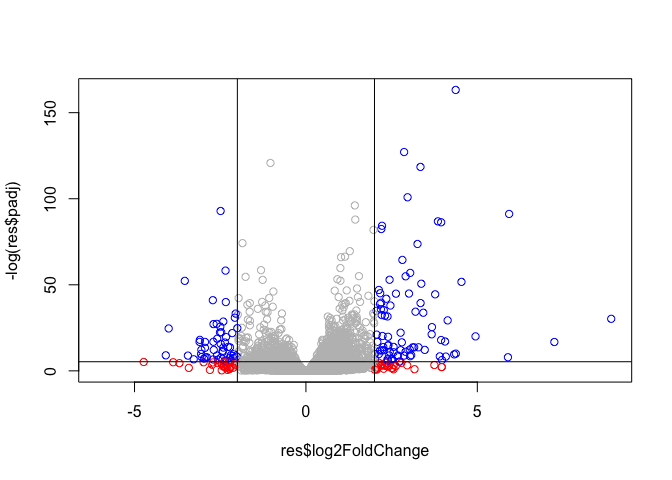

# Lab 13
Youn Soo Na (PID: A17014731)

``` r
# library(BiocManager)
# library(DESeq2)
```

Today we will analyze some RNASeq data from Himes et al. on the effects
of dexamethasone (dex), a synthetic glucocorticoid steroid on airway
smooth muscle cells (ASM).

## Data Import

``` r
counts <- read.csv("airway_scaledcounts.csv", row.names = 1)
metadata <- read.csv("airway_metadata.csv")
```

> Q1. How many genes are in this dataset?

``` r
nrow(counts)
```

    [1] 38694

> Q2. How many ‘control’ cell lines do we have?

``` r
table(metadata$dex)
```


    control treated 
          4       4 

There are 4 control cell lines.

## Toy differential expression analysis

Calculate the mean per gene count values for all “control” samples
(i.e. columns in `counts`) and do the same for “treated” and then
compare them.

1.  Find all “control” values/columns in `counts`

``` r
library(dplyr)
```


    Attaching package: 'dplyr'

    The following objects are masked from 'package:stats':

        filter, lag

    The following objects are masked from 'package:base':

        intersect, setdiff, setequal, union

``` r
control <- metadata %>% filter(dex=="control")
control.counts <- counts %>% select(control$id)
```

2.  Find the mean per gene across all control columns

``` r
control.mean <- apply(control.counts, 1, mean)
```

> Q3. How would you make the above code in either approach more robust?
> Is there a function that could help here?

``` r
# library(dplyr)
# control <- metadata %>% filter(dex=="control")
# control.counts <- counts %>% select(control$id) 
# control.mean <- rowSums(control.counts)/4
# head(control.mean)
```

3.  Repeat for treated

> Q4. Follow the same procedure for the treated samples (i.e. calculate
> the mean per gene across drug treated samples and assign to a labeled
> vector called treated.mean)

``` r
treated <- metadata$dex == "treated"
treated.counts <- counts[,treated]
```

``` r
treated.mean <- apply(treated.counts, 1, mean)
```

``` r
meancounts <- data.frame(control.mean, treated.mean)
```

> Q5 (a). Create a scatter plot showing the mean of the treated samples
> against the mean of the control samples. Your plot should look
> something like the following.

``` r
plot(meancounts)
```



> Q5 (b).You could also use the ggplot2 package to make this figure
> producing the plot below. What geom\_?() function would you use for
> this plot?

``` r
library(ggplot2)
ggplot(meancounts, aes(control.mean, treated.mean)) +
  geom_point() +
  labs(x="Control Mean", y="Treated Mean")
```



> Q6. Try plotting both axes on a log scale. What is the argument to
> plot() that allows you to do this?

``` r
# plot(meancounts, log="xy")
# or
ggplot(meancounts, aes(control.mean, treated.mean)) +
  geom_point() +
  scale_x_continuous(trans = "log2") +
  scale_y_continuous( trans = "log2" ) +
  labs(x = "Control Mean", y = "Treated Mean")
```

    Warning in scale_x_continuous(trans = "log2"): log-2 transformation introduced
    infinite values.

    Warning in scale_y_continuous(trans = "log2"): log-2 transformation introduced
    infinite values.



We most frequently use log2 transformations for this type of data.

``` r
log2(20/10)
```

    [1] 1

These log2 values make the interpretation of “fold-change” a little
easier and a rule-of-thumb in the filled is a log2 fold-change of +2 or
a -2 is where we start to pay attention.

``` r
log2(40/10)
```

    [1] 2

Let’s calculate the log2(fold-change) and add it to our `meancounts`
data.frame.

``` r
meancounts$log2fc <- log2(meancounts$treated.mean/meancounts$control.mean)

head(meancounts)
```

                    control.mean treated.mean      log2fc
    ENSG00000000003       900.75       658.00 -0.45303916
    ENSG00000000005         0.00         0.00         NaN
    ENSG00000000419       520.50       546.00  0.06900279
    ENSG00000000457       339.75       316.50 -0.10226805
    ENSG00000000460        97.25        78.75 -0.30441833
    ENSG00000000938         0.75         0.00        -Inf

``` r
to.rm <- rowSums(meancounts[,1:2]==0) > 0
mycounts <- meancounts[!to.rm,]
```

> Q7. What is the purpose of the arr.ind argument in the which()
> function call above? Why would we then take the first column of the
> output and need to call the unique() function?

Filtering data to remove genes with zero expression

``` r
zero.vals <- which(meancounts[,1:2]==0, arr.ind=TRUE)

to.rm <- unique(zero.vals[,1])
mycounts <- meancounts[-to.rm,]
head(mycounts)
```

                    control.mean treated.mean      log2fc
    ENSG00000000003       900.75       658.00 -0.45303916
    ENSG00000000419       520.50       546.00  0.06900279
    ENSG00000000457       339.75       316.50 -0.10226805
    ENSG00000000460        97.25        78.75 -0.30441833
    ENSG00000000971      5219.00      6687.50  0.35769358
    ENSG00000001036      2327.00      1785.75 -0.38194109

`arr.ind` returns a matrix of indices that correspond to the non-zero
elements (taking out the zero counts) . `unique()` prevents accidental
repeats when counting the zero entries.

> Q. How many genes do I have left after this zero count filtering?

``` r
nrow(mycounts)
```

    [1] 21817

> Q. How many genes are “up” regulated upon drug treatment at a
> threshold of +2 log2-fold-change? Q8. Using the up.ind vector above
> can you determine how many up regulated genes we have at the greater
> than 2 fc level?

1.  I need to extract the log2fc values
2.  I need to find those that are above +2
3.  Count them.

``` r
sum(mycounts$log2fc > 2)
```

    [1] 250

> Q. How many genes are “down” regulated upon drug treatment at a
> threshold of -2 log2-fold-change? Q9. Using the down.ind vector above
> can you determine how many down regulated genes we have at the greater
> than 2 fc level?

``` r
sum(mycounts$log2fc < -2)
```

    [1] 367

> Q10. Do you trust these results? Why or why not?

No, because the statistics side of this data is missing.

Missing the stats. Is the difference in the mean counts significant?

Let’s do this analysis the right way with statistics and use the
**DESeq2** package

## DESeq2 analysis

``` r
library(DESeq2)
```

The first function that we will use will setup the data in the way
(format) DESeq wants it.

``` r
dds <- DESeqDataSetFromMatrix(countData = counts, 
                       colData = metadata, 
                       design = ~dex)
```

    converting counts to integer mode

    Warning in DESeqDataSet(se, design = design, ignoreRank): some variables in
    design formula are characters, converting to factors

The function in the package is called `DESeq()` and we can run it on our
`dds` object.

``` r
dds <- DESeq(dds)
```

    estimating size factors

    estimating dispersions

    gene-wise dispersion estimates

    mean-dispersion relationship

    final dispersion estimates

    fitting model and testing

I will get the results from dds with the `results()` function:

``` r
res <- results(dds)
head(res)
```

    log2 fold change (MLE): dex treated vs control 
    Wald test p-value: dex treated vs control 
    DataFrame with 6 rows and 6 columns
                      baseMean log2FoldChange     lfcSE      stat    pvalue
                     <numeric>      <numeric> <numeric> <numeric> <numeric>
    ENSG00000000003 747.194195     -0.3507030  0.168246 -2.084470 0.0371175
    ENSG00000000005   0.000000             NA        NA        NA        NA
    ENSG00000000419 520.134160      0.2061078  0.101059  2.039475 0.0414026
    ENSG00000000457 322.664844      0.0245269  0.145145  0.168982 0.8658106
    ENSG00000000460  87.682625     -0.1471420  0.257007 -0.572521 0.5669691
    ENSG00000000938   0.319167     -1.7322890  3.493601 -0.495846 0.6200029
                         padj
                    <numeric>
    ENSG00000000003  0.163035
    ENSG00000000005        NA
    ENSG00000000419  0.176032
    ENSG00000000457  0.961694
    ENSG00000000460  0.815849
    ENSG00000000938        NA

Make a common overall results figure from this analysis. This is
designed to keep our inner biologist and inner stats nerd happy because
it plots fold-change vs P-value.

padj: p-value that has been corrected over multiple trials; stricter

``` r
# log is used to better the visualization of the p-value (more negative 
# corresponds to smaller p-value)
# - is used to flip the plot (now more positive values correspond to
# lower p-value)
plot(res$log2FoldChange, -log(res$padj))
abline(v = c(-2,2), col = "red")
abline(h = -log(0.005), col = "red")
```



Add some color to this plot

``` r
mycols <- rep("gray", nrow(res))
mycols[res$log2FoldChange > 2 | res$log2FoldChange < -2] <- "blue"
mycols[res$padj > 0.005 & res$log2FoldChange > 2] <- "red"
mycols[res$padj > 0.005 & res$log2FoldChange < -2] <- "red"


plot(res$log2FoldChange, -log(res$padj), col = mycols)
abline(v = c(-2,2), col = "black")
abline(h = -log(0.005), col = "black")
```



I want to save my results to date out to disc

``` r
write.csv(res, file = "myresults.csv")
```

We will pick this up next day and add **annotation** (i.e. what are
these genes of interest) and do pathway analysis (what biology) are they
known to be involved with.

I need to translate our gene identifiers “ENSG000…” into gene names that
the rest of the world can understand.

To do this “annotation,” I will use the **AnnotationDbi** package. I can
install this with `BiocManager::install()`

``` r
library(AnnotationDbi)
library(org.Hs.eg.db)

columns(org.Hs.eg.db)
```

     [1] "ACCNUM"       "ALIAS"        "ENSEMBL"      "ENSEMBLPROT"  "ENSEMBLTRANS"
     [6] "ENTREZID"     "ENZYME"       "EVIDENCE"     "EVIDENCEALL"  "GENENAME"    
    [11] "GENETYPE"     "GO"           "GOALL"        "IPI"          "MAP"         
    [16] "OMIM"         "ONTOLOGY"     "ONTOLOGYALL"  "PATH"         "PFAM"        
    [21] "PMID"         "PROSITE"      "REFSEQ"       "SYMBOL"       "UCSCKG"      
    [26] "UNIPROT"     

I will use the `mapIds()` function to “map” my identifiers to those from
different databases. I will go between “ENSEMBL” and “SYMBOL” (and then
after “GENENAME”).

``` r
res$symbol <- mapIds(org.Hs.eg.db,
                      keys = rownames(res),
                      keytype = "ENSEMBL",
                      column = "SYMBOL")
```

    'select()' returned 1:many mapping between keys and columns

``` r
# head(res)
```

> Q11. Run the mapIds() function two more times to add the Entrez ID and
> UniProt accession and GENENAME as new columns called `res$entrez`,
> `res$uniprot`, and `res$genename`.

Add “GENENAME”

``` r
res$genename <- mapIds(org.Hs.eg.db,
                      keys = rownames(res),
                      keytype = "ENSEMBL",
                      column = "GENENAME")
```

    'select()' returned 1:many mapping between keys and columns

``` r
head(res$genename)
```

                                                  ENSG00000000003 
                                                  "tetraspanin 6" 
                                                  ENSG00000000005 
                                                    "tenomodulin" 
                                                  ENSG00000000419 
    "dolichyl-phosphate mannosyltransferase subunit 1, catalytic" 
                                                  ENSG00000000457 
                                       "SCY1 like pseudokinase 3" 
                                                  ENSG00000000460 
      "FIGNL1 interacting regulator of recombination and mitosis" 
                                                  ENSG00000000938 
                 "FGR proto-oncogene, Src family tyrosine kinase" 

And “ENTREZID”

``` r
res$entrez <- mapIds(org.Hs.eg.db,
                     keys = rownames(res),
                     keytype = "ENSEMBL",
                     column = "ENTREZID")
```

    'select()' returned 1:many mapping between keys and columns

``` r
# head(res$entrez)
# res
```

``` r
res$uniprot <- mapIds(org.Hs.eg.db,
                      keys = rownames(res),
                      keytype = "ENSEMBL",
                      column = "UNIPROT")
```

    'select()' returned 1:many mapping between keys and columns

``` r
# head(res$uniprot)
```

save our annotated results object.

``` r
write.csv(res, file = "results_annotated.csv")
```

## Pathway Analysis

Now that we have our results with added annotations we can do some
pathway mapping.

Let’s use the **gage** package to look for KEGG pathways in our results
(genes of interest). I will also use the **pathview** package to draw
little pathway figures.

``` r
library(pathview)
library(gage)
library(gageData)

data(kegg.sets.hs)
head(kegg.sets.hs, 1)
```

    $`hsa00232 Caffeine metabolism`
    [1] "10"   "1544" "1548" "1549" "1553" "7498" "9"   

What **gage** wants as inputs is not my big table/data.frame of results.
It just wants a “vector of importance”. For RNASeq data like we have
this is our log2FC values…

``` r
foldchanges = res$log2FoldChange
names(foldchanges) = res$entrez
head(foldchanges)
```

           7105       64102        8813       57147       55732        2268 
    -0.35070302          NA  0.20610777  0.02452695 -0.14714205 -1.73228897 

Now, let’s run the gage pathway analysis.

``` r
# Get the results
keggres = gage(foldchanges, gsets=kegg.sets.hs)
# What's in this keggres object?
attributes(keggres)
```

    $names
    [1] "greater" "less"    "stats"  

``` r
head(keggres$less, 3)
```

                                          p.geomean stat.mean        p.val
    hsa05332 Graft-versus-host disease 0.0004250461 -3.473346 0.0004250461
    hsa04940 Type I diabetes mellitus  0.0017820293 -3.002352 0.0017820293
    hsa05310 Asthma                    0.0020045888 -3.009050 0.0020045888
                                            q.val set.size         exp1
    hsa05332 Graft-versus-host disease 0.09053483       40 0.0004250461
    hsa04940 Type I diabetes mellitus  0.14232581       42 0.0017820293
    hsa05310 Asthma                    0.14232581       29 0.0020045888

Let’s use the **pathview** package to look at one of these highlighted
KEGG pathways with our genes highlighted. “hsa05310 Asthma”

``` r
pathview(gene.data=foldchanges, pathway.id="hsa05310")
```

    'select()' returned 1:1 mapping between keys and columns

    Info: Working in directory /Users/nayounsoo/Desktop/BIMM 143/bimm143test/Lab 13/Lab 13

    Info: Writing image file hsa05310.pathview.png


