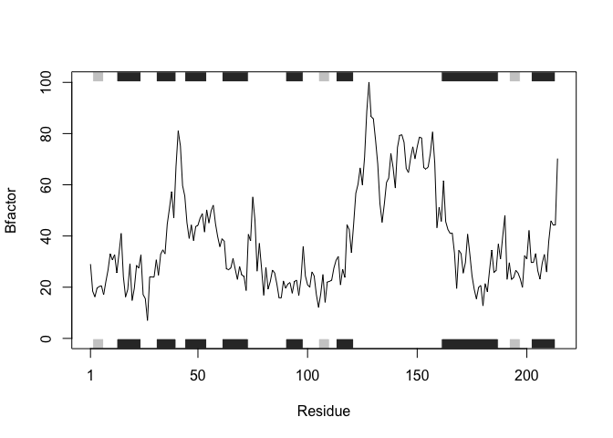
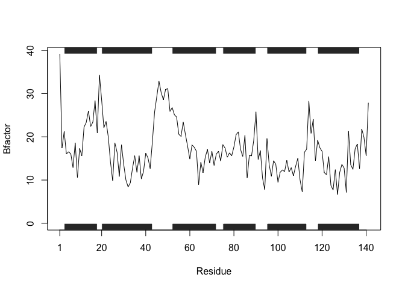

# Class 6: R functions and R packages from CRAN and BioConductor
Youn Soo Na (PID:A17014731)

``` r
# Can you improve this analysis code?
library(bio3d)
s1 <- read.pdb("4AKE") # kinase with drug
```

      Note: Accessing on-line PDB file

``` r
s2 <- read.pdb("1AKE") # kinase no drug
```

      Note: Accessing on-line PDB file
       PDB has ALT records, taking A only, rm.alt=TRUE

``` r
s3 <- read.pdb("1E4Y") # kinase with drug
```

      Note: Accessing on-line PDB file

``` r
s1.chainA <- trim.pdb(s1, chain="A", elety="CA")
s2.chainA <- trim.pdb(s2, chain="A", elety="CA")
s3.chainA <- trim.pdb(s1, chain="A", elety="CA")
s1.b <- s1.chainA$atom$b
s2.b <- s2.chainA$atom$b
s3.b <- s3.chainA$atom$b
plotb3(s1.b, sse=s1.chainA, typ="l", ylab="Bfactor")
```



``` r
plotb3(s2.b, sse=s2.chainA, typ="l", ylab="Bfactor")
```


``` r
plotb3(s3.b, sse=s3.chainA, typ="l", ylab="Bfactor")
```


x \<- read.pdb(“protein”) x.chainA \<- trim.pdb(x, chain=“A”,
elety=“CA”) x.b \<- x.chainA&atom\$b plotb3(x.b, sse=xchainA, typ=“l”,
ylab=“Bfactor”)

## ANSWER

``` r
snippet <- function(x) {
  y <- read.pdb(x)
y.chainA <- trim.pdb(y, chain="A", elety="CA")
y.b <- y.chainA$atom$b
plotb3(y.b, sse=y.chainA, typ="l", ylab="Bfactor")
}
```

## TESTING

``` r
snippet("1Y31")
```

      Note: Accessing on-line PDB file



## NOTE

Make this into a function

- 1st get a simple working snippet of code
- make it as simple as possible
- reduce code duplication
- then turn into a function
- test it then fix errors
